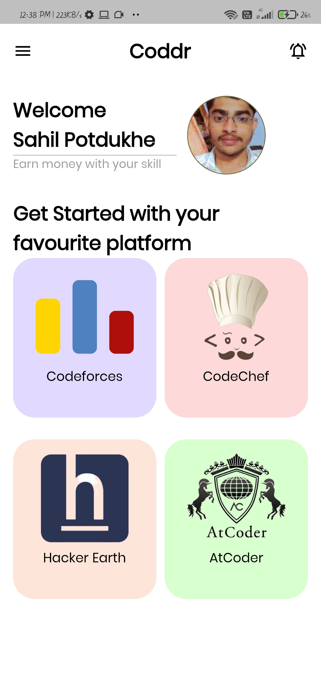
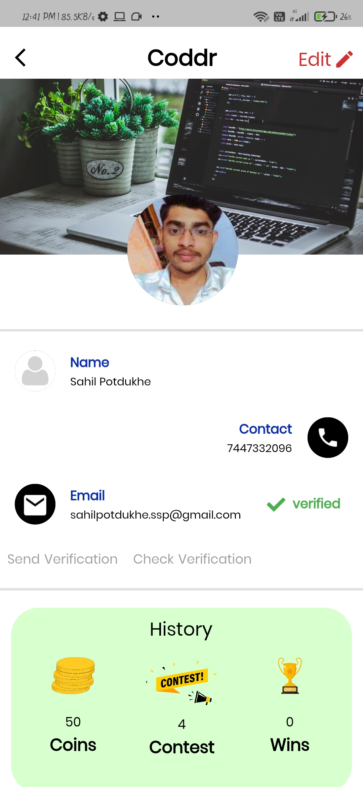
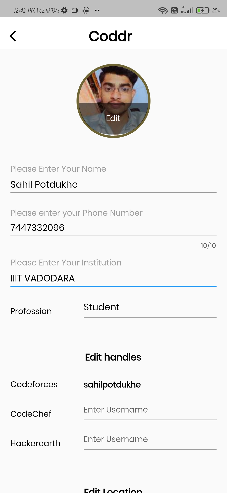
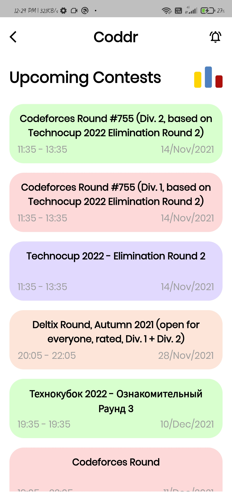
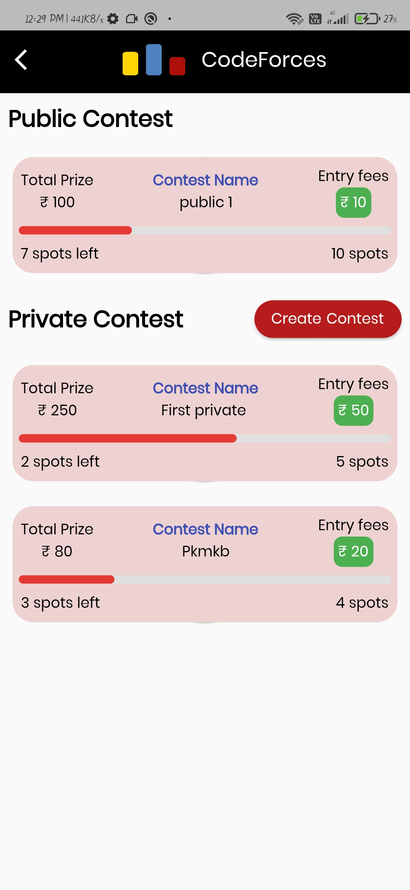
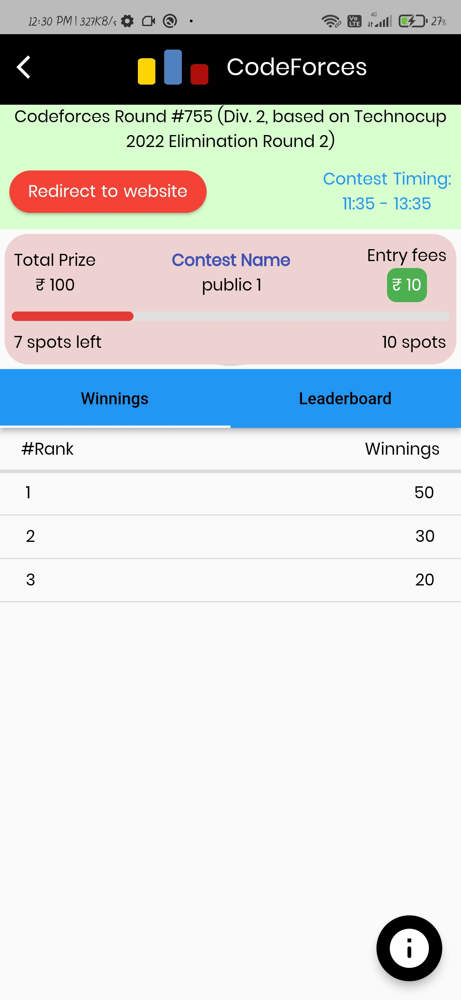
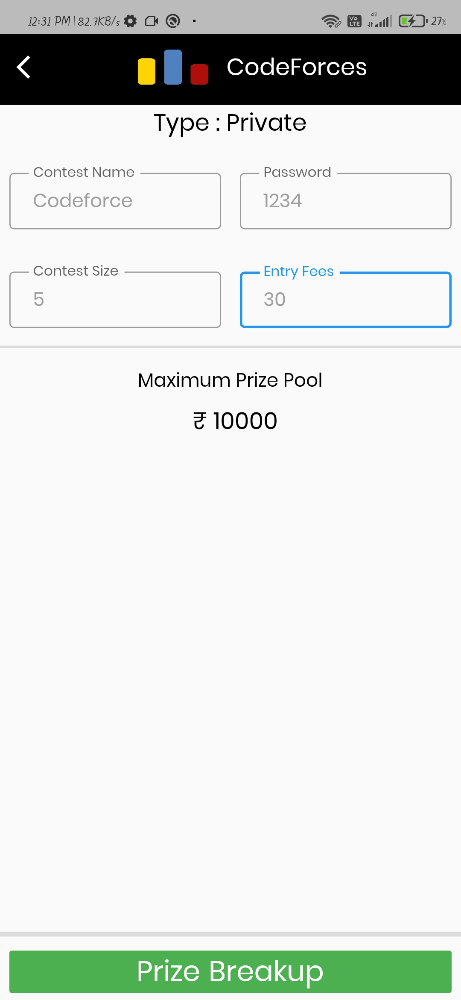
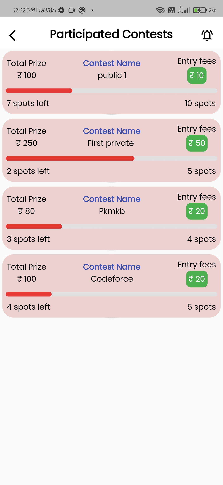
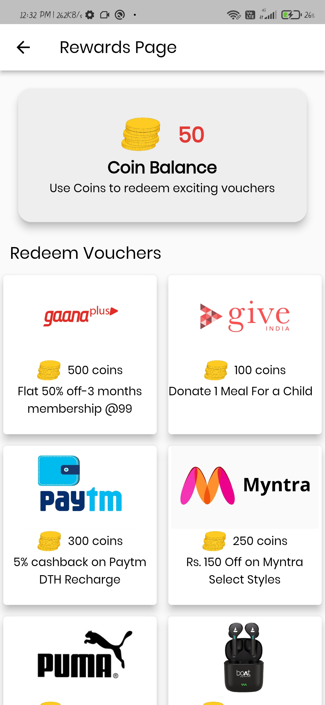

# Coddr
 - Coddr is an android application which aims to make the journey of excelling Data Structure and Algorithm(DSA)skills more profitable and satisfying.
 
 - It helps users to participate in coding contests in various platforms like Codeforces, Codechef, etc  and compete in the curated contest.
 - The winners in the curated contest will get coins according to their rank and they can redeem various rewards by using the coins.
 - The app helps user create contests by the user so that a group of friends can compete among themselves by using specific password.

## Features

- Authentication
- Edit Profile
- Email Verification
- Coding Handles Verification
- Create Curated Contest
- Directing to website
- Redeem Rewards

## 🛠 Technologies and Framework Used
- Figma(to design UI)
- Flutter Framework(Dart language)
- Firebase(for Authentication And Storing Data)
- Bloc(for state management)
- Clean Architecture
- API(Get data from The coding platforms)

## Usage/Examples

```javascript
import 'package:flutter/material.dart';
void main() async {
  WidgetsFlutterBinding.ensureInitialized();
  await Firebase.initializeApp();
  runApp(MyApp());
}

//MyApp
class MyApp extends StatefulWidget {
  @override
  _MyAppState createState() => _MyAppState();
}
class _MyAppState extends State<MyApp> {
    Widget build(BuildContext context) {
        return MaterialApp();
}
```
## Demo


## Images
 
### SignUp page:
#### Page for the registration of users.The Authentication is done using firebase.

 
 ### Home page:
#### This will be the first landing page of the app when user will login to the application and have multiple options of coding platforms as shown in the picture.

     
### Profile page:
#### User’s profile page which contains the essential information of the user and it’s past records in the platforms.


### Edit Profile page:
#### User can edit his profile in this page accept some critical details.

     
### Upcoming Contest page:
#### These are the list of contest available on the chosen coding platforms.This list is fetched from API of particular coding platform.

     
### Curated Contest page:
#### Curated Contests will be created both platform admins and users, independent of the platform where user is participating.

     
### Curated Contest Details Page:
#### The page contains all the details of the curated contest that the user has participated in.It has the feature of redirecting to the platform's website.

     
### Contest Creation page:
#### Page to create the curated contest by filling the details such as contest name,password,size and entry fee.

     
     
### Participated Contest page:
#### It shows the list of past participated contests of a particular user.
     
 
      
### Rewards page:
#### User can redeem the reward based on there coin balance.


## Contributing
Contributions are always welcome!
If you have a suggestion that would make this better, please fork the repo and create a pull request. Don't forget to give the project a star! Thanks again!
- Fork the Project
- Create your Feature Branch (```bash git checkout -b feature/AmazingFeature```)
- Commit your Changes (```bash git commit -m 'Add some AmazingFeature'```)
- Push to the Branch (```bash git push origin feature/AmazingFeature```)
- Open a Pull Request 

## Contributors ✨
<table>
<tr>
<td align="center"><a href="https://github.com/abhisheksahu121">Abhishek Sahu</a></td>
<td align="center"><a href="https://github.com/mrcchef">Abhijeet Tamrakar</a></td>
<td align="center"><a href="https://github.com/Kshittiz21">Kshittiz Bhardwaj</a></td>
<td align="center"><a href="https://github.com/sahilpotdukhe">Sahil Potdukhe</a></td>
</tr>
